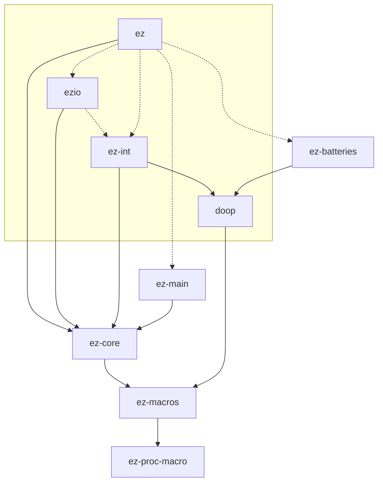

This project isn't ready to take contributions.

## Crate Structure

## Licensing

Unless you explicitly state otherwise, any contribution intentionally submitted
for inclusion in this project by you, as defined in the Apache License 2.0,
shall be dual licensed as described in [the `LICENSE` file](LICENSE), without
any additional terms or conditions.
